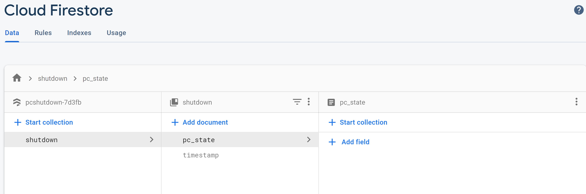
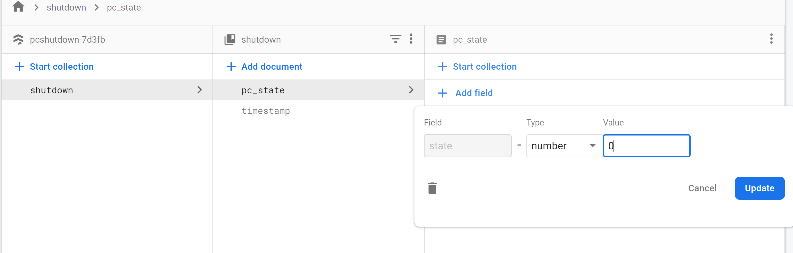

I developed this python script to remotely turn off from my PC from anywhere. This helps me whenever I am to lazy to get up from bed to turn off my PC. I hope you find it useful too. Please feel free to use this project anyway you like.

This is a python script that listens to change in a firebase firestore's (database) field called "state". This python script activates every time I turn on my PC and sets the state value to 1.

## Getting Started

### Note: I tested this with python 3.62 and on Windows only.

### 1. Install Python dependencies

    pip install -r requirements.txt

I prefer to install all my dependencies in a virtual environment.

### 2. Create Firebase Project and add `firebase-sdk.json` to your main project directory

> Firebase is a service provided by Google. If you dont have a firebase account, then sign up. it is free.

> Look for Firebase Admin SDK in the Project settings. From there, you can download the a json file which some configurations that will help you connect your python script to Firebase firestore database. Rename the downloaded file to firebase-sdk.json and place it in the project root directory.

### 3. Create Firebase Firestore database

> Add collection and document as shown in the image (first and second) below. The python script uses these exact values. Also change the rules to allow read and write (third image)




### 4. Test script

> Run the python code. It will set the PC state to 1 in database. As soon as you change the state value from 1 to 0, it will shutdown your pc. The timestamp is also updated every time you change state.



### 5. (Optional)Create executable file using pyinstaller

> Uncomment this line

    os.chdir(sys._MEIPASS)

> Till now you have to run the script manually first in order to remotely shutdown your PC. This is no fun. We need to automatically start this script on startup. So I created an executable file. Yes, an exe file that runs like any windows program. I achieved this using pyinstaller. It should be already be installed if you have done step 1. Run this command to create an executable file.

        pyinstaller   --onefile -F --add-data "firebase-sdk.json;." app.py

> This will create app.exe file in dist directory. Now put this app.exe in your startup directory.

> If you are facing issues, refer to the Troubleshoot section.

## Troubleshoot (Google is your best friend)

1. How to find start up directory?
   To open the “Startup” folder the easy way, just hit Windows+R to open the “Run” box, type “shell:startup,” and then press Enter.
   [Reference: howtogeek.com](https://www.howtogeek.com/208224/how-to-add-programs-files-and-folders-to-system-startup-in-windows-8.1/#:~:text=To%20open%20the%20%E2%80%9CStartup%E2%80%9D%20folder%20the%20easy%20way%2C%20just,to%20the%20%E2%80%9CStartup%E2%80%9D%20folder.)

2. pyinstaller failed to create app.py
   you will need to add `hook-grpc.py` file in to your pyinstaller. first, you will need to figure out where is you pyinstaller installed. I added `hook-grpc.py` under `...\Lib\site-packages\PyInstaller\hooks` with following code:

   ```
       from PyInstaller.utils.hooks import collect_data_files
       datas = collect_data_files('grpc')

   ```

   [Reference: Stackoverflow](https://stackoverflow.com/questions/51745571/exception-in-grpc-when-trying-to-execute-google-cloud-api?rq=1)

3. I am getting NoReturn error when running the script.
   This is due to old version of python. I tried to run it with 3.61 and ran into this issue. I upgraded to 3.62

4. Windows anti-virus not letting me run the app.exe file.
   Your antivirus thinks that it is a virus. you will your anti-virus that it is not a virus, so It will stop bothering you.

5. Is there any other way to add the script to your startup directory
   I found [this on Stackoverflow](https://stackoverflow.com/questions/4438020/how-to-start-a-python-file-while-windows-starts) but never tried it. Basically to you can add the python script directly to your start up.

6. You are so awesome and I have more questions?
   Message me through [Contact me](https://shapaplay.com/contact.html) page.
